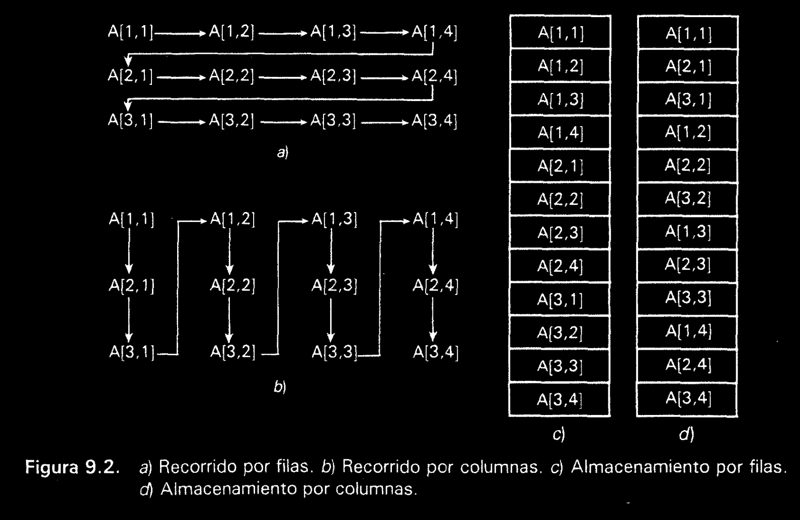

# Python

## output

### **Imprimir con formato** *float*, *decimales*

En python un especificador de formato para imprimir un número con una cantida especificada de decimales se representa con la siguiente sintaxis:

```python
{:.nf}
```

Donde 'n' es el numero de decimales que desea mostrar.

Ejemplo: 

```python
# Utilizando cadenas de formato
numero = 123.456789
print("{:.2f}".format(numero)) # imprimirá el numero con dos decimales: 123.45

# Utilizando f-strings
print(f"{numero:.2f}") # tambien imprimirá el numero con dos decimales 123.45
```

Si deseas mostrar un número con un número de variable de decimales, puedes utilizar una variable para especificar la cantidad de decimales:

```python
numero = 123.456789
decimales = 4

print("{:.{}f}".format(numero,decimales)) # imprimira el numero con cuatro decimales 123.4567

# Utilizando f-strings
print(f"{numero:.{decumales}f}") # tambien imprimira el numero con cuatro decimales
```

Al usar `{:.{}f}`, el primer corchete representa el numero a formatear y el segundo corchete con `{}` representa la variable que contiene la cantidad de decimales que desea mostrar.


Otro uso basico del metodo `format()`

```python
    print("We are the {} who say '{}!'".format('knights','Ni'))

    # out: We are the knights who say 'Ni!'
``` 

Las llaves y caracteres dentro de las mismas (llamados campos de formato) son reemplazadas con los objetos pasados en el método `str.format()`. Un número en las llaves se refiere a la posición del objeto pasado en el método `str.format()`.

```python
    print("{0} and {1}".format('spam','eggs'))
    # spam and eggs

    print("{1} and {0}.".format('spam','eggs'))
    # eggs and spam
```

Si se usan argumentos nombrados en el método `str.format()`, sus valores se referencian usando el nombre del argumento

```python
    print("This {food} is {adjetive}.".format(food='spam', adjetive='absolutely horrible'))

    # out: This spam is absolutely horrible.
```

Si tiene una cadena de caracteres de formato realmente larga que no desea dividir, sería bueno si pudiera hacer referencia a las variables que se formatearán por nombre en lugar de por posición. Esto se puede hacer simplemente pasando el diccionario y usando corchetes `[]` para acceder a las claves.

```python
    table = {'Sjoerd': 4127, 'Jack': 4098, 'Dcad': 8637678}
    print('Jack: {0[Jack]:d}; Sjoerd: {0[Sjoer]:d}; Dcab: {0[Dcab]:d}.'.format(table))

    # out: Jack: 4098; Sjoerd: 4127; Dcab: 8637678
```

Esto se podría hacer, también, pasando el diccionario `table` como argumentos por palabra clave con la notación “**”.

```python
    table = {'Sjoerd': 4127, 'Jack': 4098, 'Dcab': 8637678}
    print('Jack: {Jack:d}; Sjoerd: {Sjoerd:d}; Dcab: {Dcab:d}'.format(**table))
```

Esto es particularmente útil en combinación con la función integrada `vars()`, que retorna un diccionario conteniendo todas las variables locales.

Como ejemplo, las siguientes líneas producen un conjunto ordenado de columnas que dan enteros y sus cuadrados y cubos:

```python
    for x in range(1, 11)
        print('{0:2d} {1:3d} {2:4d}'.format(x, x*x, x*x*x))

    # out: 
"""  1   1    1
     2   4    8
     3   9   27
     4  16   64
     5  25  125
     6  36  216
     7  49  343
     8  64  512
     9  81  729
    10 100 1000
"""
```


### Modificadores para convertir variables

Se pueden utilizar otros modificadores para convertir el valor antes de formateo. `!a` se aplica `ascii()`, `!s` se aplica `str()`, y `!r` se aplica `repr()`

```python
    animal = 'cat'

    print(f"My house is full of {animal}")
    # out: My house is full of cat

    print(f"My house is full of {animal!r}")
    # out: My house is full of 'cat'
```

El especificador `=` puede utilizarse para expandir una expresión al texto de la expresión, un signo igual y, a continuación, la representacion de la expresión evaluada.

```python
    bugs = 'roaches'
    count = 13
    area = 'living room'
    print(f"Debugging {bugs=} {count=} {area=}")
    # Debugging bugs='roaches' count=13 area='living room'
```


### Caracteres de escape 

En Python, los caracteres de escape son secuencias especiales que se utilizan en secuencia de texto para representar caracteres que de otra manera seria dificiles de insertar directamente en el codigo.

1. `\n`: Salto de línea. Insertar una nueva linea de cadena.
2. `\t`: Tabulacion. Insertar un carácter de tabulación en la cadena.
3. `\\`: Barra invertida. Inserta un carácter de barra invertida en la cadena.
4. `\'`: Comilla simple. Inserta una comilla simple en la cadena.
5. `\"`: Comilla doble. Inserta una comilla doble en la cadena.
6. `\r`: Retorno de carro. Se utiliza para realizar un retorno de carro (retorno al inicio de la linea) en algunas plataformas.
7. `\b`: Retroceso. Borra un carácter antes del cursor en la cadena.
8. `\f`: Avance de página. Insertar un caracter de avance de pagina.
9. `\v`: Tabulacion vertical. Inserta un carácter de tabulación vertical.
10. `\xhh` : Representacion hexadecimal. Inserta un caracter correspondiente al valor hexadecimal `hh`.

## Math

### `math.floor()`

El metodo `math.floor()` se utiliza para redondear un numero hacia abajo al entero mas cercano o igual al numero original. 

Su sintaxis es: 
```python
    import math 

    resultado = math.floor(numero)
```

Donde `numero` es el valor numerico al cual deseas aplicar el redondeo hacia abajo.

ejemplo: 

```python
    import math

    numero = 7.6
    resultado = math.floor(numero)

    print(resultado) # out: 8
```

## Errores

### `int too large convert to float`

El error *int too large to convert to float* en Python ocurre cuando intentas convertir un entero demasiado grande en un valor de punto flotante (`float`), y el entero excede la cantidad de formato `float` para representar números enteros con precisión completa.
El formato `float` tiene una capacidad finita para representar números grandes y pequeños con precisión limitada.

Si estas trabajando con números enteros muy grandes y necesitas mantener la presicisión, puedes considerar mantener la presicion utilizando el metodo `Decimal()` del modulo `decimal` que proporciona representación decimal de alta precision. Ejemplo:

```python
    from decimal  import Decimal

    entero_grande = 1234567890123456789012345678901234567890
    decimal_entero = Decimal(entero_grande)
    print(decimal_grande) # Output: 1234567890123456789012345678901234567890
```

Si no necesitas una alta precisión y solo deseas imprimir o mostrar el número grande, puedes utilizar el formato de cadena sin convertirlo a `float`:

```python
    entero_grande = 123456789012345678901234567890
    print(str(entero_grande)) # Output: 123456789012345678901234567890
```

En este caso, simplemente convertimos el número grande a una cadena y lo imprimimos directamente. Esto evitará el problema de convertir el entero grande en un `float`.


## Modulo `msvcrt`

### `getch()`
El metodo `getch()` del modulo `msvcrt` en Python se utiliza para capturar la entrada del teclado de manera sencilla y sin necesidad de presionar Enter. Este metodo es especialmente útil en aplicaciones donde se requiere una entrada de teclado inmediata y sin buffer.

Ejemplo:

```python
    print("Presiona una tecla: ")
    
    # in: s
    tecla_presionada = msvcrt.getch()
    
    print(f"Presionaste la tecla: {tecla_presionada.decode('utf-8')}")
    # out: s
```

otras variantes del metodo: 

#### `getwch()`

Variante de caracteres anchos de getch(), que devuelve un valor Unicode.

Ej. 

```python
    print("Presiona una tecla: ")

    # in: s
    tecla_presionada = msvcrt.getwch()

    print(f"Presionaste la tecla: {tecla_presioada}")
    # out: s
```


### Como funciona el `as` en Python

En Python, la palabra clave `as` se utiliza principalmente para crear alias o nombres alternativos para módulos, clases, funciones y otros objetos. Su principal función es permitirte darle a un objeto un nombre más corto o más significativo para facilitar su uso en tu código.

Aquí tienes algunos ejemplos de cómo se utiliza la palabra clave `as` en diferentes contextos:

1. **Alias para módulos:**
```python
import math as m
print(m.sqrt(25))  # En lugar de math.sqrt(25)
```

2. **Alias para clases:**
```python
from datetime import datetime as dt
today = dt.now()  # En lugar de datetime.datetime.now()
```

3. **Alias para funciones:**
```python
from math import factorial as fact
result = fact(5)  # En lugar de math.factorial(5)
```

4. **Alias para nombres de objetos:**
```python
my_long_variable_name = 42
short = my_long_variable_name  # Usar un alias para el nombre largo
```

Es importante mencionar que, aunque el uso de `as` puede hacer que tu código sea más legible, también debes tener cuidado de elegir nombres que aún sean descriptivos y fáciles de entender. Usar `as` en exceso o elegir nombres ambiguos puede dificultar la comprensión del código para otras personas que lo lean en el futuro.

### Como funciona el `assert` en Python

En Python, la palabra clave `assert` se utiliza como una herramienta de depuración para verificar si una expresión es verdadera. Si la expresión es verdadera, no ocurre nada y el programa continúa su ejecución normal. Sin embargo, si la expresión es falsa, se genera una excepción `AssertionError` y el programa se detiene en ese punto, lo que te permite identificar y corregir errores en tu código.

La sintaxis básica del `assert` es la siguiente:

```python
assert expresión, mensaje_de_error
```

Donde:
- `expresión` es la condición que deseas verificar. Si esta condición es falsa, se generará un `AssertionError`.
- `mensaje_de_error` es un argumento opcional que puedes proporcionar para personalizar el mensaje de error que se mostrará cuando la aserción falle.

Aquí tienes un ejemplo de cómo usar `assert`:

```python
def dividir(a, b):
    assert b != 0, "El divisor no puede ser cero"
    return a / b

resultado = dividir(10, 0)
print(resultado)
```

En este ejemplo, la función `dividir` utiliza `assert` para verificar que el divisor `b` no sea cero antes de realizar la división. Si `b` es cero, se generará un `AssertionError` con el mensaje "El divisor no puede ser cero".

Es importante mencionar que las aserciones (`assert`) se utilizan principalmente para depurar y verificar condiciones que deberían ser siempre verdaderas en tu código. No deben confundirse con manejo de errores o validaciones más robustas para situaciones inesperadas en producción. En la mayoría de los casos, las aserciones se desactivan en entornos de producción para mejorar el rendimiento y la seguridad del programa. Esto se hace pasando el parámetro `-O` (letra "o" en mayúscula) al ejecutar el script, lo que deshabilita las aserciones. Por ejemplo:

```
python -O tu_script.py
```

En resumen, `assert` es una herramienta útil para verificar suposiciones y condiciones durante la depuración de tu código, pero se debe usar con precaución y solo para propósitos de desarrollo y depuración.

### Como funciona el `yield` en Python

En Python, la palabra clave `yield` se utiliza en la definición de una función para crear un generador. Un generador es un tipo especial de función que produce una secuencia de valores en lugar de calcularlos y devolverlos todos de una vez. El `yield` permite pausar la ejecución de la función y "devolver" un valor temporalmente, luego reanudar la función desde donde se detuvo en la próxima iteración.

Cuando se utiliza `yield`, la función se convierte en un generador, y cada vez que se llama a la función, no se ejecuta de manera lineal como una función regular. En su lugar, se ejecuta hasta que encuentra una declaración `yield`, en ese punto "pausa" y devuelve el valor especificado, y el estado de la función se guarda. Luego, la próxima vez que se llama a la función, se reanuda desde donde se detuvo y continúa ejecutándose hasta encontrar la próxima declaración `yield` o hasta que termine.

Aquí tienes un ejemplo simple para entender cómo funciona `yield`:

```python
def contador(n):
    i = 0
    while i < n:
        yield i
        i += 1

# Crear un generador
gen = contador(5)

# Iterar a través del generador
for num in gen:
    print(num)
```

En este ejemplo, la función `contador` es un generador que produce una secuencia de números del 0 al 4. Cada vez que se llama a la función y se encuentra la declaración `yield`, se "pausa" y devuelve el valor actual de `i`. Luego, en la próxima iteración del bucle `for`, se reanuda desde donde se detuvo y continúa hasta que la condición se cumpla.

El uso de `yield` es útil cuando necesitas generar una secuencia de valores de manera eficiente, especialmente si la secuencia es grande y no deseas almacenarla completamente en memoria. Los generadores son especialmente útiles para iterar sobre conjuntos de datos grandes o secuencias infinitas.

En resumen, `yield` se utiliza para crear generadores en Python, lo que permite generar secuencias de valores de manera eficiente y sin necesidad de almacenarlos completamente en memoria.

### Como funciona `del` en Python

En Python, la palabra clave `del` se utiliza para eliminar objetos o variables, liberando la memoria que ocupan y permitiendo que sean eliminados por el recolector de basura. `del` se utiliza en diferentes contextos para eliminar varios tipos de objetos:

1. **Eliminar variables:**
   Puedes usar `del` para eliminar variables y liberar la memoria que ocupan. Por ejemplo:

   ```python
   x = 10
   del x  # Elimina la variable x
   ```

2. **Eliminar elementos de una lista o diccionario:**
   `del` también se usa para eliminar elementos específicos de una lista o diccionario utilizando su índice o clave. Por ejemplo:

   ```python
   lista = [1, 2, 3, 4]
   del lista[2]  # Elimina el tercer elemento de la lista (índice 2)
   
   diccionario = {'a': 1, 'b': 2, 'c': 3}
   del diccionario['b']  # Elimina la clave 'b' y su valor del diccionario
   ```

3. **Eliminar elementos de una colección usando slices:**
   Puedes usar `del` con slices para eliminar un rango de elementos de una lista o una sección de un objeto mutable. Por ejemplo:

   ```python
   lista = [1, 2, 3, 4, 5]
   del lista[1:4]  # Elimina los elementos con índices 1, 2 y 3
   
   cadena = "Python"
   del cadena[2]  # No es válido en este caso, ya que las cadenas son inmutables
   ```

4. **Eliminar objetos:**
   `del` también se puede usar para eliminar objetos, como instancias de clases personalizadas. Si una instancia deja de ser referenciada, el recolector de basura eliminará automáticamente el objeto, por lo que en muchos casos no es necesario usar `del`.

Es importante tener en cuenta que `del` elimina solo la referencia al objeto y libera su memoria si no hay otras referencias a ese objeto. No todos los objetos pueden ser eliminados directamente usando `del`, ya que algunos objetos pueden ser manejados automáticamente por el recolector de basura cuando dejan de ser accesibles.

En resumen, `del` se utiliza para eliminar variables, elementos de listas o diccionarios, y también puede usarse con slices para eliminar rangos de elementos.

### Como funciona el `nonlocal` en python

En Python, la palabra clave `nonlocal` se utiliza en una función anidada para indicar que una variable definida en una función exterior (pero no en la función global) debe ser considerada no local en lugar de global. Esto permite modificar y acceder a la variable en la función anidada sin crear una nueva variable local con el mismo nombre.

La necesidad de `nonlocal` surge cuando tienes una función anidada dentro de otra función, y deseas modificar una variable que está en el ámbito de la función exterior, no en el ámbito global. Aquí tienes un ejemplo para entender cómo funciona `nonlocal`:

```python
def funcion_exterior():
    variable_exterior = 10
    
    def funcion_anidada():
        nonlocal variable_exterior
        variable_exterior += 1
        print("Variable exterior modificada:", variable_exterior)
    
    funcion_anidada()

funcion_exterior()
```

En este ejemplo, `variable_exterior` es una variable en el ámbito de la función `funcion_exterior`. Dentro de `funcion_anidada`, se utiliza la palabra clave `nonlocal` para indicar que la variable a la que se hace referencia es la variable en el ámbito de `funcion_exterior`, no una nueva variable local. Como resultado, el valor de `variable_exterior` se incrementa dentro de `funcion_anidada` y se muestra correctamente después de la modificación.

Es importante mencionar que `nonlocal` solo es relevante cuando hay anidamiento de funciones y cuando se desea modificar una variable en un nivel superior de anidamiento. Si la variable está en el ámbito global, no necesitas `nonlocal`. Si la variable está en el ámbito local de la función actual, simplemente puedes modificarla sin usar `nonlocal`.

En resumen, `nonlocal` se utiliza para indicar que una variable en una función anidada debe ser considerada no local en lugar de global, lo que permite modificarla y acceder a ella en el nivel de anidamiento superior.

### Como funciona `lambda` en python

En Python, `lambda` es una palabra clave que se utiliza para crear funciones anónimas, también conocidas como funciones lambda. Estas son funciones pequeñas y simples que se definen de manera compacta y pueden tener una o varias expresiones, pero no contienen una declaración de bloque de código como una función regular definida con `def`.

La sintaxis básica de una función lambda es la siguiente:

```python
lambda argumentos: expresión
```

Donde:
- `argumentos` son los parámetros de la función.
- `expresión` es la operación que la función realiza y devuelve.

Aquí tienes un ejemplo simple de cómo se utiliza `lambda`:

```python
suma = lambda x, y: x + y
resultado = suma(3, 5)
print(resultado)  # Imprime 8
```

En este ejemplo, se ha creado una función lambda llamada `suma` que toma dos argumentos `x` e `y`, y devuelve la suma de estos valores. Luego, se llama a la función `suma` con los valores `3` y `5`, y se almacena el resultado en la variable `resultado`.

Las funciones lambda son útiles cuando necesitas definir una función pequeña y simple en línea, por ejemplo, para pasarla como argumento a otras funciones que esperan una función como entrada, como en el caso de `map`, `filter`, `sorted`, entre otros.

Aunque las funciones lambda son convenientes para ciertas situaciones, es importante tener en cuenta que su uso excesivo o en contextos complejos puede dificultar la legibilidad del código. En general, se recomienda utilizar funciones regulares definidas con `def` para casos más complejos y cuando se necesita un mayor nivel de claridad en el código.

### Funcion `filter()`.

La función `filter()` en Python se utiliza para filtrar elementos de una secuencia (como una lista, tupla o conjunto) basándose en una función de filtrado que se aplica a cada elemento. La función de filtrado debe ser una función que devuelva un valor booleano (True o False) para cada elemento. Solo los elementos para los cuales la función de filtrado devuelve `True` se incluirán en el resultado.

La sintaxis básica de la función `filter()` es la siguiente:

```python
filter(función_de_filtrado, secuencia)
```

Donde:
- `función_de_filtrado`: Es la función que define el criterio de filtrado. Debe tomar un argumento (un elemento de la secuencia) y devolver `True` o `False`.
- `secuencia`: La secuencia de elementos que deseas filtrar.

Aquí tienes un ejemplo para ilustrar cómo funciona la función `filter()`:

```python
# Función de filtrado para números pares
def es_par(numero):
    return numero % 2 == 0

numeros = [1, 2, 3, 4, 5, 6, 7, 8, 9, 10]

# Filtrar los números pares de la lista
numeros_pares = filter(es_par, numeros)

# Convertir el resultado a una lista
numeros_pares_lista = list(numeros_pares)

print(numeros_pares_lista)  # Imprime [2, 4, 6, 8, 10]
```

En este ejemplo, la función `es_par()` se utiliza como función de filtrado para identificar números pares. La función `filter()` devuelve un objeto de tipo `filter`, que puedes convertir a una lista u otra secuencia para obtener los elementos filtrados.

Es importante tener en cuenta que la función `filter()` no modifica la secuencia original, sino que crea un nuevo iterador que proporciona los elementos que cumplan con el criterio de filtrado.

### Formas de pasar parametros en funciones en python

En Python, puedes pasar parámetros a funciones de diversas maneras, lo que te permite adaptar la función para que trabaje con diferentes valores. Aquí hay varias formas de pasar parámetros a funciones:

1. **Pasar por Valor (por defecto):**
   Los argumentos se pasan por valor en Python. Esto significa que una copia del valor del argumento se pasa a la función. Las modificaciones realizadas dentro de la función no afectan al valor original fuera de ella.

   ```python
   def funcion(parametro):
       parametro += 1

   valor = 5
   funcion(valor)
   print(valor)  # Imprime 5 (sin cambios)
   ```

2. **Pasar por Referencia (en el caso de objetos mutables):**
   Si pasas objetos mutables (como listas o diccionarios) como argumentos, los cambios realizados dentro de la función afectarán al objeto original, ya que la referencia al objeto se pasa a la función.

   ```python
   def modificar_lista(lista):
       lista.append(10)

   mi_lista = [1, 2, 3]
   modificar_lista(mi_lista)
   print(mi_lista)  # Imprime [1, 2, 3, 10]
   ```

3. **Pasar Argumentos por Posición:**
   Los argumentos se pasan en el mismo orden en que se definen en la función. Es la forma más común de pasar argumentos.

   ```python
   def funcion(a, b):
       # hacer algo con a y b

   funcion(5, 10)
   ```

4. **Pasar Argumentos por Nombre:**
   Puedes pasar argumentos fuera de orden al especificar su nombre al llamar a la función.

   ```python
   def funcion(a, b):
       # hacer algo con a y b

   funcion(b=10, a=5)
   ```

5. **Pasar Argumentos por Posición y Nombre Juntos:**
   Puedes combinar ambas formas al llamar a una función.

   ```python
   def funcion(a, b, c):
       # hacer algo con a, b y c

   funcion(5, c=20, b=10)
   ```

6. **Pasar un Número Variable de Argumentos:**
   Puedes usar `*args` para pasar un número variable de argumentos posicionales y `**kwargs` para pasar argumentos clave-valor.

   ```python
   def funcion(*args, **kwargs):
       # args es una tupla de argumentos posicionales
       # kwargs es un diccionario de argumentos clave-valor

   funcion(1, 2, 3, a=10, b=20)
   ```

7. **Pasar una Función como Argumento:**
   Puedes pasar funciones como argumentos a otras funciones. Esto es útil para implementar funciones de orden superior.

   ```python
   def aplicar_funcion(func, lista):
       return [func(x) for x in lista]

   def cuadrado(x):
       return x ** 2

   numeros = [1, 2, 3, 4]
   resultado = aplicar_funcion(cuadrado, numeros)
   ```

8. **Uso de Valores Predeterminados en los Parámetros:**
   Puedes proporcionar valores predeterminados para los parámetros, lo que permite llamar a la función sin proporcionar todos los argumentos.

   ```python
   def saludar(nombre="Usuario"):
       print(f"Hola, {nombre}!")

   saludar()           # Imprime "Hola, Usuario!"
   saludar("Juan")     # Imprime "Hola, Juan!"
   ```

Estas son algunas de las formas en que puedes pasar parámetros a funciones en Python. La elección depende de tus necesidades específicas y del comportamiento deseado de la función.

### Tipo de dato 

Puedes utilizar la función `type()` en Python para obtener el tipo de dato de una variable. Aquí tienes un ejemplo:

```python
# Variables de diferentes tipos de datos
numero = 5
cadena = "Hola, mundo!"
lista = [1, 2, 3]
diccionario = {"a": 1, "b": 2}
conjunto = {1, 2, 3}
booleano = True

# Obtener el tipo de dato de cada variable
print(type(numero))        # <class 'int'>
print(type(cadena))        # <class 'str'>
print(type(lista))         # <class 'list'>
print(type(diccionario))   # <class 'dict'>
print(type(conjunto))      # <class 'set'>
print(type(booleano))      # <class 'bool'>
```

La función `type()` devuelve un objeto de tipo `type` que representa el tipo de dato de la variable. Puedes utilizar esta información para verificar el tipo de tus variables en tu código.

### Alternativa `if`

Una alternativa al uso del condicional `if` en Python es el uso de expresiones condicionales ternarias (también conocidas como operadores ternarios) y, en algunos casos, estructuras de datos como diccionarios.

1. **Expresiones Condicionales Ternarias:**
   Las expresiones condicionales ternarias permiten realizar una evaluación rápida en una sola línea. La sintaxis es:
   
   ```python
   resultado_si_true if condición else resultado_si_false
   ```

   Ejemplo:

   ```python
   edad = 20
   mensaje = "Mayor de edad" if edad >= 18 else "Menor de edad"
   print(mensaje)  # Imprime "Mayor de edad"
   ```

2. **Diccionarios para Emular Switch:**
   Si tienes múltiples casos a evaluar, podrías usar un diccionario para emular una especie de estructura switch-case. Aquí tienes un ejemplo:

   ```python
   def operacion(a, b, operador):
       operaciones = {
           "+": a + b,
           "-": a - b,
           "*": a * b,
           "/": a / b
       }
       return operaciones.get(operador, "Operador no válido")

   resultado = operacion(10, 5, "+")
   print(resultado)  # Imprime 15
   ```

3. **Usar Funciones y Métodos:**
   En lugar de usar condicionales directamente, puedes usar funciones y métodos para realizar diferentes tareas según las condiciones.

   ```python
   def funcion_para_condicion_verdadera():
       # hacer algo

   def funcion_para_condicion_falsa():
       # hacer algo diferente

   condicion = True
   accion = funcion_para_condicion_verdadera if condicion else funcion_para_condicion_falsa
   accion()
   ```

Es importante considerar la legibilidad y la claridad del código al elegir entre estas alternativas al condicional `if`. El uso de `if` es generalmente más claro en muchos casos, pero las expresiones ternarias y las técnicas mencionadas pueden ser útiles en situaciones donde se necesita concisión o flexibilidad.

## Manipulación de tablas.

El orden más natural de procesar los vectores es el orden secuencial: del primero al último elemento. En el caso de las tablas o de los arrays multidimensionales, existen diferentes órdenes para su recorrido. Los más usuales son: *recorrido por filas y recorrido por columnas.*

### Recorrido por filas/columnas.

Los elementos de la primera fila/columna se procesan primero, a continuación los de la segunda fila/columna, y asi sucesivamente. Sea el array *A* de 3 filas y 4 columnas. La siguiente figura muestra graficamente los recorridos.




Better Comments